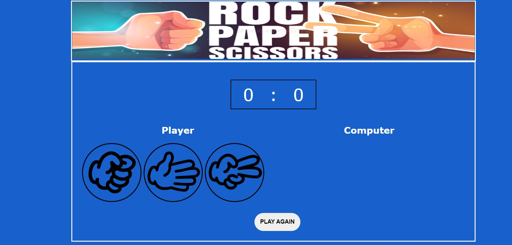

# RockPaperScissors

## Description

This game is played by children and adults and is popular all over the world. Apart from being a game played to pass time, the game is usually played in situations where something has to be chosen. It is similar in that way to other games like flipping the coin, throwing dice or drawing straws. There is no room for cheating or for knowing what the other person is going to do so the results are usually very satisfying with no room for fighting or error.
Although the game has a lot of complexity to it, the rules to play it are pretty simple.
The game is played where players deliver hand signals that will represent the elements of the game; rock, paper and scissors. The outcome of the game is determined by 3 simple rules:

* Rock wins against scissors.
* Scissors win against paper.
* Paper wins against rock.

### Wireframe

https://docs.google.com/presentation/d/1GV0TsUnoYR-eE-C_H6AzwBPQJSRlYHYgTR4rb4EHgj8/edit?usp=sharing

### How to play

It is very easy to play this game. You just need to select the appropriate picture in the player's field and wait for the computer to choose. When you win or lose a round, the corresponding sound and inscription will appear, as well as the win counter for the respective parties will change. To reset all current data, press the button "PLAY AGAIN". 

### Explanations of specific Technologies

For this game were used HTML for setup gameboard, CSS for adding color elements and styling and JavaScript for adding functionality of the game. DOM was used for increment scors, to add buttons click events, to appearance win/loss/draw messages and sounds.

### Approach Taken

To develop the design of my game, I looked at the already existing versions of the game. I chose the one that I liked more and seemed more understandable, added some elements, modified the issuance of computer options and text messages.

### Link to Hosted Site

https://lyubmila.github.io/RockPaperScissors/

### Installation Instructions

Clone the repo. Open with VS Code and use index.html for start the game.